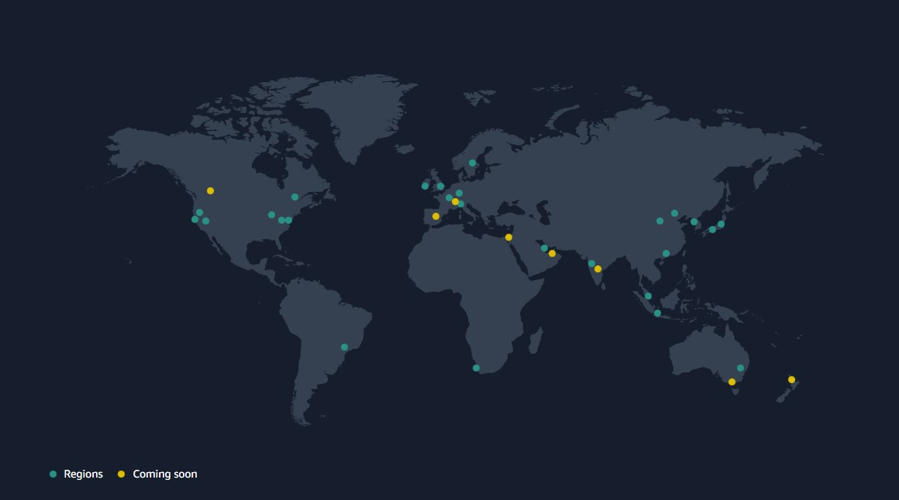

### **Infraestrutura Global da AWS**

Existem atualmente **27 regiões** lançadas, **87 zonas de disponibilidade** e mais de **410 pontos de presença**.

#### **US East**

- **N. Virginia** us-east-1
- **Ohio** us-east-2

#### **US West**

- **N. California** us-west-1
- **Oregon** us-west-2

#### **Africa**

- **Cape Town** af-south-1

#### **Asia Pacific**

- **Hong Kong** ap-east-1
- **Jakarta** ap-southeast-3
- **Mumbai** ap-south-1
- **Osaka** ap-northeast-3
- **Seoul** ap-northeast-2
- **Singapore** ap-southeast-1
- **Sydney** ap-southeast-2
- **Tokyo** ap-northeast-1

#### **Canada**

- **Central** ca-central-1

#### **Europe**

- **Frankfurt** eu-central-1
- **Ireland** eu-west-1
- **London** eu-west-2
- **Milan** eu-south-1
- **Paris** eu-west-3
- **Stockholm** eu-north-1

#### **Middle East**

- **Bahrain** me-south-1
- **UAE** me-central-1

#### **South America**

- **São Paulo** sa-east-1
