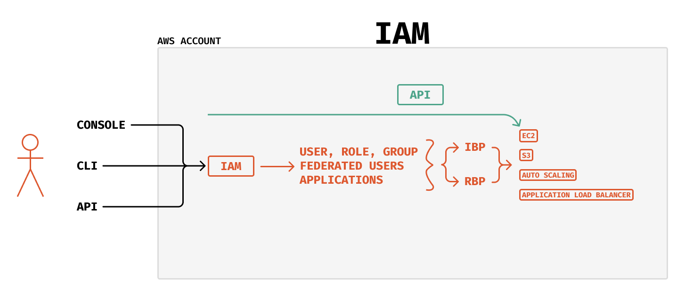

### **O que significa a sigla IAM?**

*Identity and Access Management* (Gerenciamento de Identidade e Acesso)

### **O que é o recurso IAM?**

Este recurso da AWS é onde é feito o controle de permissões e acessos, ele garante se você tem ou não determinado privilégio, para realizar determinada ação dentro da AWS.

### **O que posso fazer no recurso IAM?**

Posso criar `user`, `role`, `groups`, `federated users` e/ou `applications`. A partir destas criações, podemos definir políticas, e existem dois tipos de políticas, a *Identity Base Policy* e a *Resource Base Policy*. A partir dessas configurações de acesso, o usuário passa a ter acesso aos serviços da AWS.

