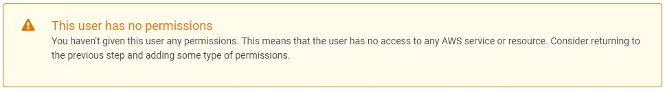
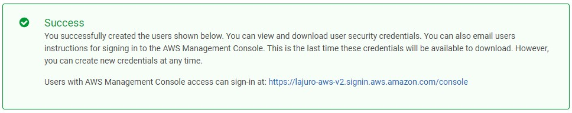
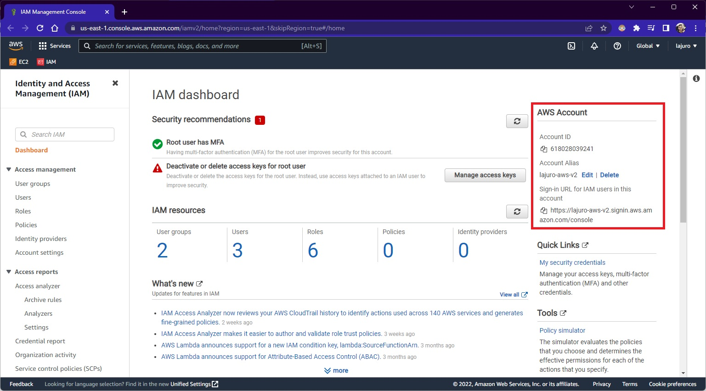
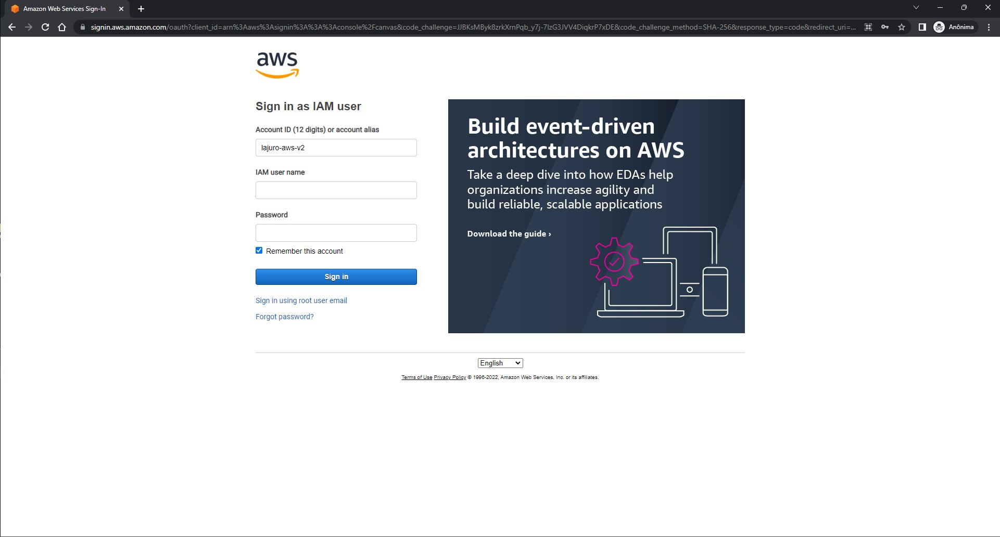
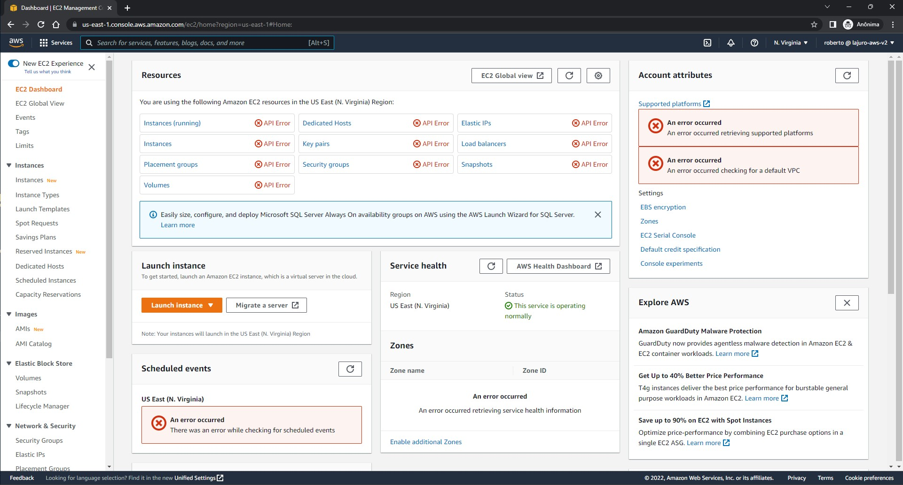

### **Mas pera aí, já não tenho um usuário na AWS?**

Sim, porém este usuário é o *root*, é o usuário principal, com acesso administrativo na AWS, neste caso iremos criar uma outra conta no IAM utilizando o usuário root.

### **Certo, então como eu crio um usuário IAM na AWS?**

Bem simples, basta no campo de busca do Console AWS, pesquisar por IAM e então, no menu lateral esquerdo clicar em *Users* e finalmente *Add users*.

O legal, é que como o próprio botão já informa, é possível criar mais de um usuário e então definir qual o tipo de acesso que esse(s) usuário(s) irá(vão) ter.

Existem dois tipos de acesso AWS:

- **Access key - Programmatic access:** Com este acesso, permite o acesso a AWS utilizando API, AWS CLI, SDK ou outras ferramentas de desenvolvimento.
- **Password - AWS Management Console access:** Este acesso é o próprio Console da AWS, este mesmo que está utilizando para criar o usuário, ou para acessar outros serviços da AWS através da própria interface web.

#### **Definindo a senha e suas regras**

Pode ser utilizado a opção de auto geração de senha ou então definir uma senha padrão e também pode ser definido que no primeiro login deste usuário, ele poderá definir sua própria senha, após utilização de uma senha temporária.

### **Permissões**

Certo, chegamos na etapa de configuração das permissões, nesta etapa você poderá adicionar o usuário a grupos de acesso, copiar permissões de outro usuário criado para este usuário que está sendo criado, ou então já adicionar políticas que darão algumas permissões para o usuário, já pré-definidas pela AWS juntamente com outras políticas personalizadas caso tenha criado.

Porém você pode também, criar um usuário sem permissão alguma, nesta aula foi criado o usuário sem atribuir em nenhum grupo e/ou política. É possível definir um limite de permissão, ou criar sem este limite, nesta aula foi criado sem este limite.

### **Tags**

Neste local você pode definir alguns parâmetros para organização de dados, como por exemplo, criar um campo com a chave `Departamento` e o valor `TI`, para dizer que esse usuário é do departamento de TI, podendo utilizar esses dados para o que precisar, inclusive definir permissionamento com base no valor preenchido.

### **Revisão**

Esta parte é apenas para ter certeza de que todos os dados preenchidos estão corretos para poder finalmente criar o usuário em questão, inclusive se não tiver atribuído nenhuma permissão, será aqui que verá uma mensagem alertando sobre isso:

Após clicar em *Create user*, você verá o usuário que foi criado, o `Access key ID`, o `Secret access key` e também uma opção de envio de e-mail com o acesso deste usuário.

Aparecerá também um alerta informando qual a URL que será utilizada para realizar o login deste usuário para esta conta AWS, no meu caso, está utilizando um `Account Alias`, basicamente um apelido para não precisar ser o número da Conta AWS:

  <h4>Importante</h4>
  
<b>Não clique na URL</b> antes de <b>salvar estas credenciais</b>, pois no momento em que clica nesta URL, você será deslogado da sua conta logada atualmente.

  
Porém, você pode abrir uma <u>guia anônima</u> ou um <u>outro navegador</u> e então acessar esta URL para logar com o usuário e senha definido.

### **Logando no Usuário Criado**

Após a criação do usuário, você pode acessar a URL informada no alerta que aparece após a criação, ou então, ao acessar a página do IAM, na lateral direita você encontra as informações da URL de login:

Ao acessar a URL, você verá uma tela como a seguinte:

Como não foi configurado nenhuma permissão para este usuário, se tentar acessar algum serviço, será exibido um alerta informando que não tem acesso:

  Concluímos, é desta forma que conseguimos criar um usuário IAM na AWS.

