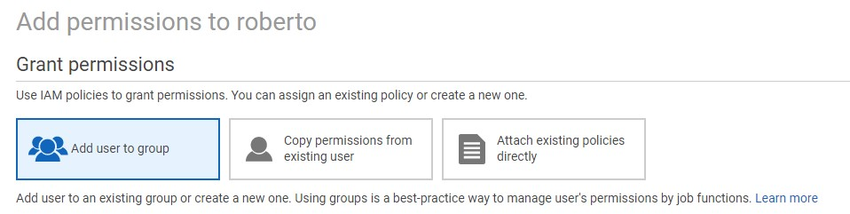
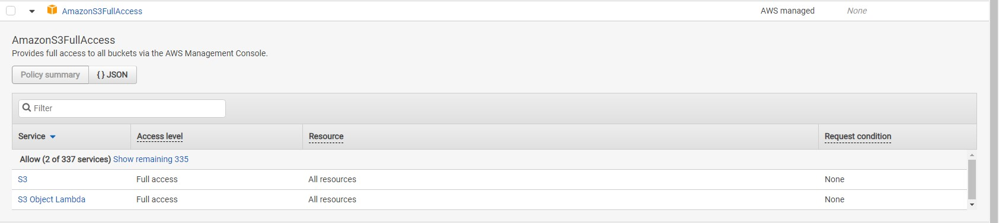
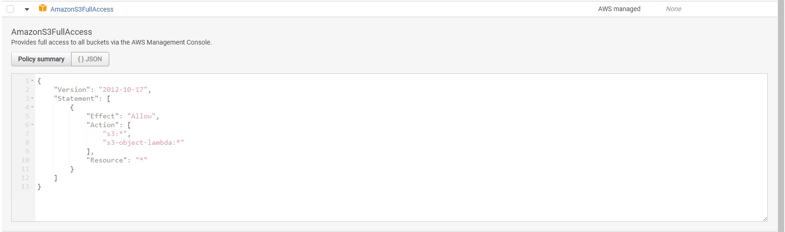

### **Adicionando permissão**

Para adicionar uma permissão a um usuário, você tem 3 formas:

#### **Add user to groups**

Através dessa opção você pode adicionar o usuário a um grupo, como por exemplo:

- Criar um grupo `Desenvolvedor`, o qual tem permissões que um desenvolvedor precisa dentro da AWS.
- Criar um grupo `Infraestrutura`, o qual o time de infraestrutura consegue cuidar de serviços relacionados a área de infraestrutura.

#### **Copy permissions from existing user**

Você pode selecionar um usuário já criado o qual foi dado algumas permissões as quais sejam aplicáveis a este usuário também.

#### **Attach existing policies directly**

Você pode adicionar políticas de acesso as quais você consegue controlar o tipo de acesso que esse usuário pode ter, por padrão, a AWS já tem criado diversas políticas que podem facilitar o processo de definição de políticas, porém podem ser criados políticas personalizadas.

### **Dando permissão de administrador para o usuário**

Iremos, para esse exemplo da aula, adicionar uma política de acesso ao usuário, a política que será adicionada será a `AdministratorAccess`, do tipo `Job function`, este usuário tem o acesso praticamente idêntico ao do usuário `root`, porém o usuário root é o dono da conta AWS e não pode ser excluído.

Apenas selecione a caixa de seleção da política `AdministratorAccess` e então clique em `Next: Review`, verifique se está tudo correto e em seguida clique em `Add permissions`.

### **Acessando a AWS através do usuário IAM**

Ao acessar o usuário que foi criado e dado a permissão de administrador, você verá que diferentemente de antes, que não tinha visão de nada, que tinham diversos alertas de acesso negado, agora este usuário poderá fazer praticamente qualquer ação dentro da AWS, com acesso a todos os serviços.

### **Inspecionando as permissões**

Se você abrir as permissões existentes dentro de cada política, você tem a opção de visualizar essas permissões através de um arquivo JSON, ou através de um resumo:

- **Policy summary**

- **JSON**

