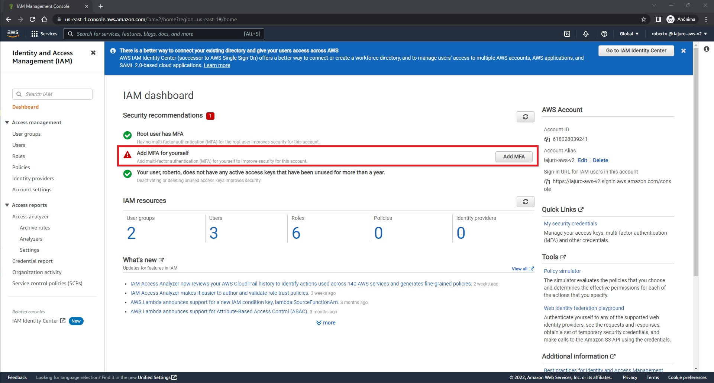
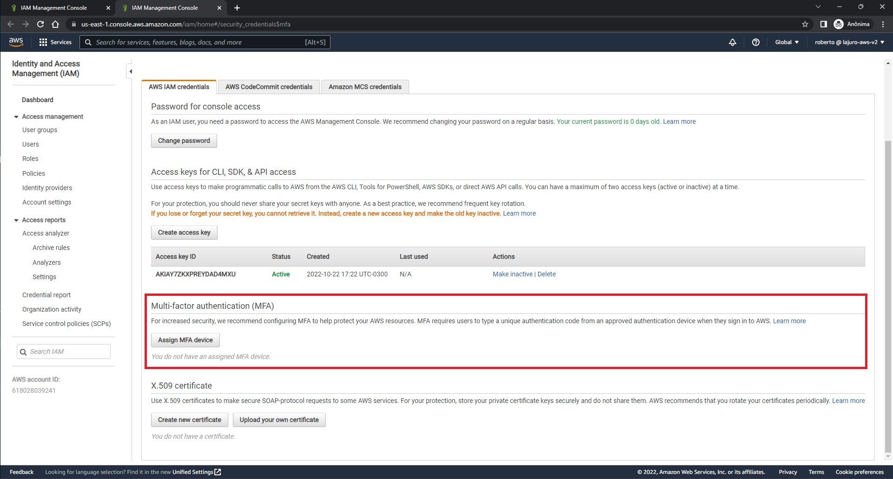

### **Como habilitar o MFA?**

Para que possa habilitar o MFA, acesse seu usuário IAM pela página de login que pode ser encontrado a URL na página principal do serviço IAM na lateral direita. Após realizado o login com o seu usuário IAM, acesse o serviço IAM, você verá logo de cara que falta adicionar o MFA para este usuário:

Clique em `Add MFA` para adicionar o MFA, e então na tela que abrir, siga até a seção `Multi-factor authentication (MFA)` e clique em `Assign MFA device`:

Após clicar em `Assign MFA device`, você apenas deverá seguir a configuração para utilização de um dispositivo MFA, o mais comum é o `Virtual MFA device`, que pode ser utilizado um aplicativo, como o `Google Authenticator` ou `Microsoft Authenticator`, por exemplo.

<a target="_blank" href="https://aws.amazon.com/iam/details/mfa/" class="btn btn-secondary">Saiba os métodos MFA disponíveis</a>
