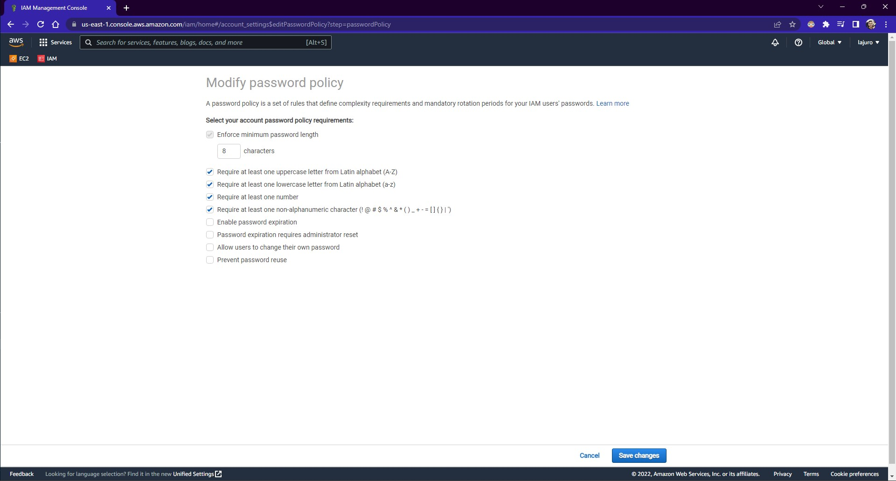

### **Definindo uma política de senhas no IAM**

Para isso, acesse o serviço IAM e então no menu lateral esquerdo, acesse `Account settings` para que ali possa definir a política de senhas no IAM (Password policy).

Para mudar essa política, clique em `Change` na seção `Password policy`, e então defina como deseja que uma senha seja definida e finalmente clique em `Save changes` e pronto, foi definido uma política de senhas.

