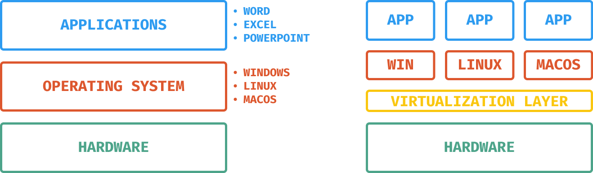

A virtualização dentro da AWS chama-se EC2 (Elastic Compute Cloud).

Antigamente, era necessário adquirir e configurar um `Hardware`, que tinha o seus componentes, que são as memórias, armazenamento, placa de vídeo, processador, etc... Além disso, tinha também o `Sistema Operacional`, que fica entre os aplicativos e o hardware. Os sistemas operacionais são vários, como Windows, Linux e MacOS.

Além do sistema operacional e o hardware, também tem os aplicativos, como por exemplo: Word, Excel, PowerPoint, etc...

### **E de onde veio a ideia da virtualização?**

Em cima de um sistema operacional, quanto mais aplicativos eu instalo, mais pesado ele fica. Foi pensado *"Por que não, colocar por cima de um hardware, vários sistemas operacionais?"* e então veio a ideia da virtualização.

### **Como funciona?**

Seguindo a mesma linha, possui um `hardware`, porém acima disso possui uma aplicação que é instalada no hardware, chamada `virtualization layer` (camada de virtualização). Acima dessa camada, temos então os sistemas operacionais, o quanto esse hardware conseguir ter.

Fora do mundo cloud, uma empresa tem, por exemplo, um sistema financeiro o qual exige 8GB de RAM e pouco processamento, então esta empresa adquire um servidor de acordo com essa sua necessidade. Porém por que não comprar com 16GB de RAM prevendo um possível cenário de crescimento próximo da empresa, ou então 32GB?

Bom, tudo isso custa dinheiro, então se você tem ali um servidor com uma capacidade muito acima do necessário para o seu projeto, o dinheiro está sendo gasto desnecessariamente, pois se 8GB já resolve, se tiver 16GB ou 32GB terá muito processamento sem necessidade alguma. Porém deixando os 8GB, se derrepente crescer o projeto, deixará de funcionar, ou seja, não é auto-escalável.

Na EC2, cada sistema operacional acima da camada de virtualização, chama-se `Instances` (Instâncias).
