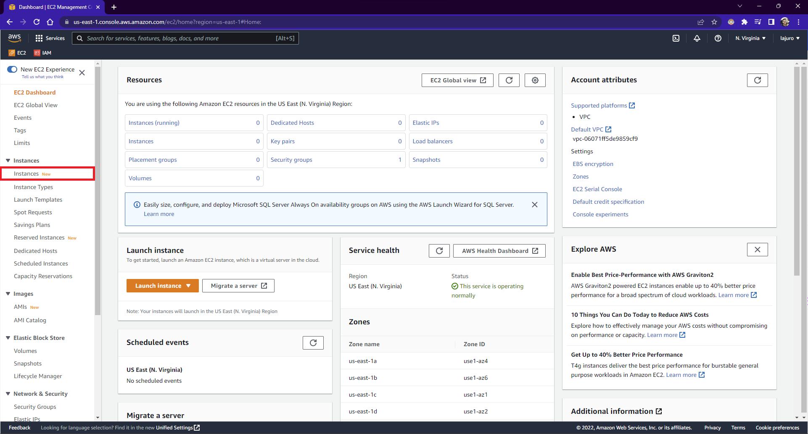
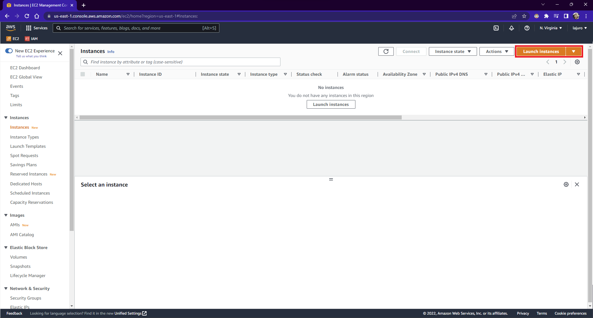
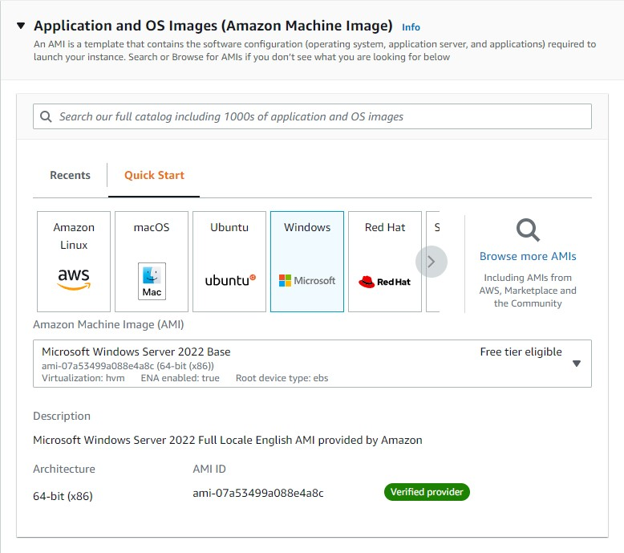
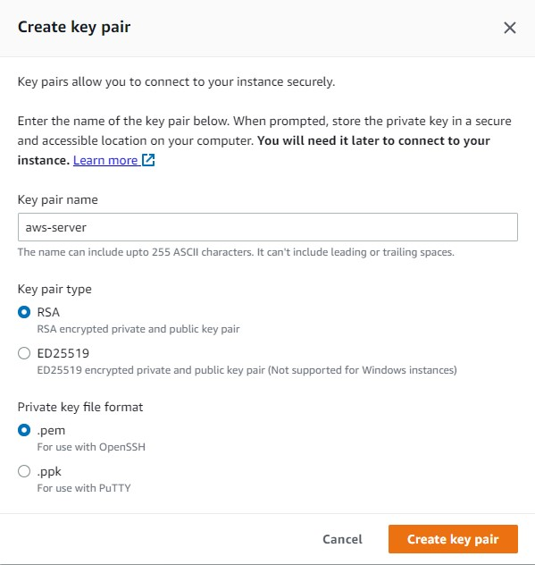
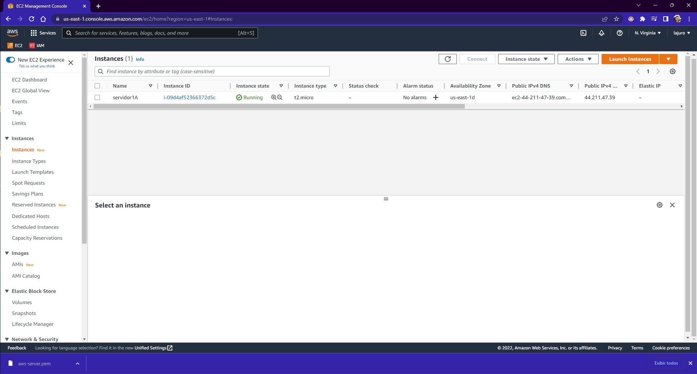

### **Como criar uma instância?**

Para criar uma instância, você deve acessar o serviço EC2 no console da AWS e no menu lateral esquerdo selecionar `Instances`:

E então clique em `Launch instances`:

### **Criando a instância**

Na tela que abriu você terá as opções de criação da sua instância.

#### **Nome**

O nome você pode colocar de acordo com o que o projeto desse servidor tem ou ao que é relativo.

#### **Application and OS Images (Amazon Machine Image)**

Aqui é selecionado qual a imagem que deseja criar, com quais configurações e sistema operacional que deseja em sua máquina virtual.

  <h4>Importante</h4>
  
Selecione uma opção <i>Free tier eligible</i> para que não seja cobrado.

#### **Instance Type**

Aqui você seleciona o tipo de máquina que deseja, o quão potente que você quer que ela seja, também é importante atentar-se ao `Free tier eligible`.

#### **Key pair (login)**

Esta chave permite conectar com segurança na sua instância, caso não tenha uma criada, será necessário criar.

Salvando com o tipo `.pem` te permite converter para `.ppk` em qualquer momento.

  <h4>Importante</h4>
  
Salve esse arquivo em seu computador de maneira segura.

#### **Network settings**

Nas configurações de rede, você seleciona o grupo de segurança que irá atribuir a essa instância, um grupo de segurança é um conjunto de regras de firewall que controla o tráfego da sua instância, para o curso, é recomendado permitir o tráfego ssh para somente o `Meu IP`.

***

Após isso, podemos clicar em `Launch instance`, para que nossa instância seja criada. Após a criação, ela ficará com o status de `Pending`, aguarde até que fique com o status de `Running`, para que possa acessar sua máquina.

