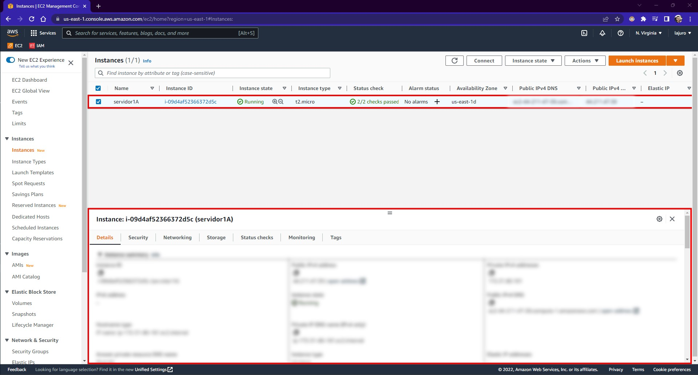
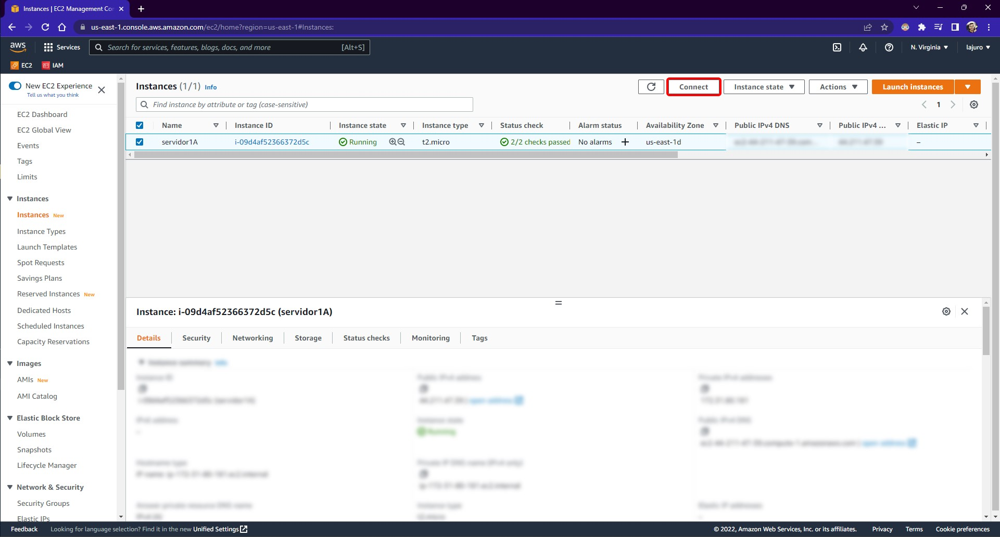
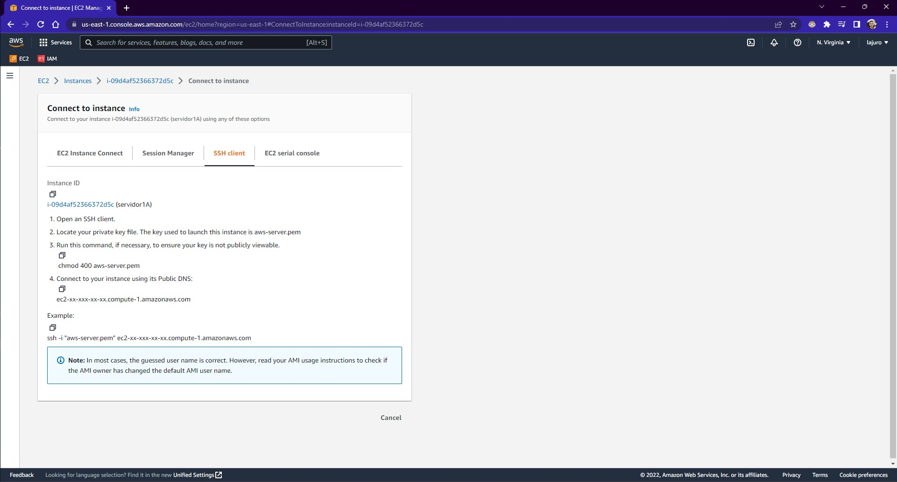
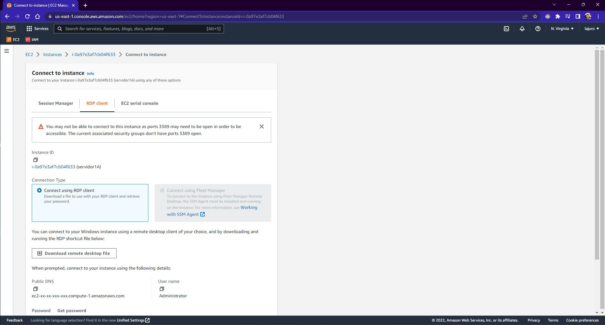
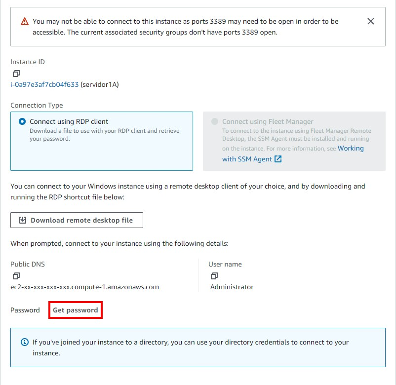
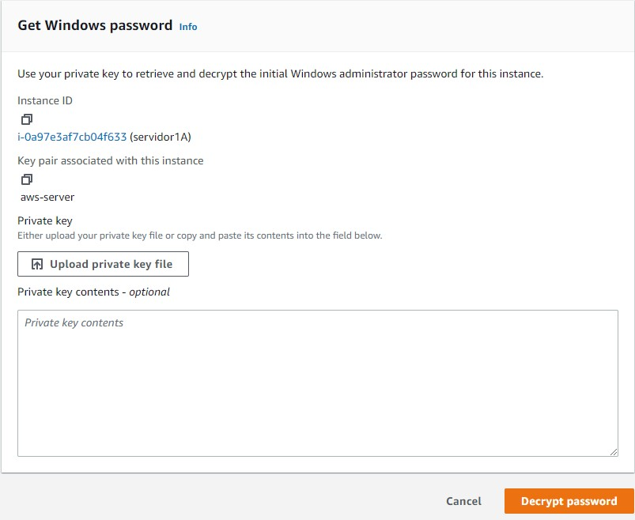
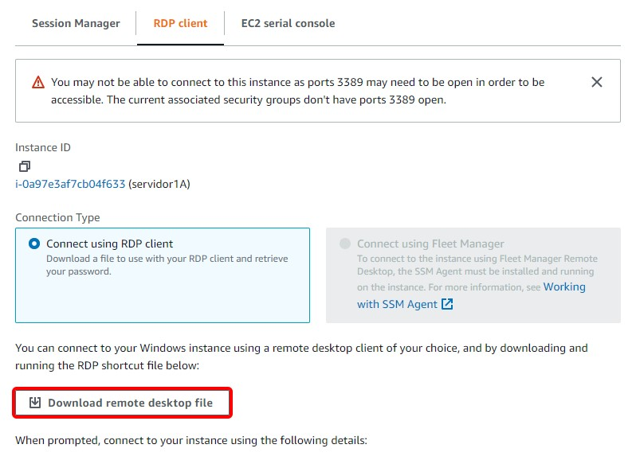
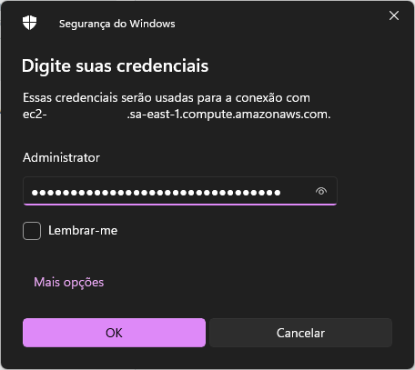
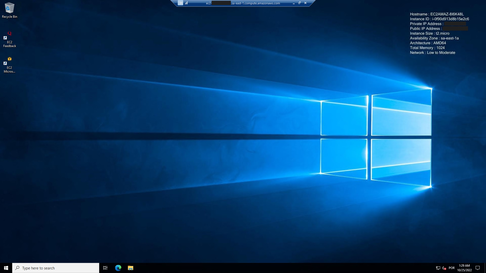

### **Como acessar minha instância EC2?**

Acesse o serviço de EC2 na AWS e acesse o menu `Instances`, no menu lateral esquerdo. Selecione a instância em execução que está querendo acessar que irá abrir as informações da instância.



Para conectar, é só selecionar a instância e clicar em `Connect`:



#### **Linux**

Agora você deve selecionar a forma que deseja se conectar, a forma mais comum é através do SSH client:



Para conectar na máquina você deverá digitar um comando parecido a esse:

```bash
ssh -i "aws-server.pem" ec2-user@ec2-xx-xxx-xx-xx.compute-1.amazonaws.com
```

Porém pode ser que ocorra um erro de arquivo com permissão muito aberta, e para correção desse erro é apenas necessário rodar o seguinte comando:

```bash
chmod 400 aws-server.pem
```

O nome `aws-server.pem` foi o nome que escolhi, porém varia de acordo com o arquivo que criou e atribuiu a instância que está acessando.

#### **Windows**

Agora você deve selecionar a forma que deseja se conectar, a forma mais comum é a RDP client:



Para que consiga conectar na máquina virtual você precisa da senha da máquina, para isso clique em `Get password`:



Nesta próxima tela, você deverá realizar o upload do arquivo de chave de pareamento que da o acesso a máquina:



Então acesse o arquivo que você pode baixar na tela de conexão da máquina:



<div class="alert alert-warning">
  <h4>Importante</h4>
  <p>Para máquina Windows é importante que o Security Group tenha liberado o RDP para acesso remoto.</p>
</div>

Para acessar a sua máquina do Windows, abra o arquivo RDP baixado e conecte-se usando a senha descriptografada:



Após ter logado, você deverá ver o seguinte:



<div class="alert alert-success">
  <h4>Sucesso</h4>
  <p>Você agora tem uma máquina rodando na AWS.</p>
</div>
