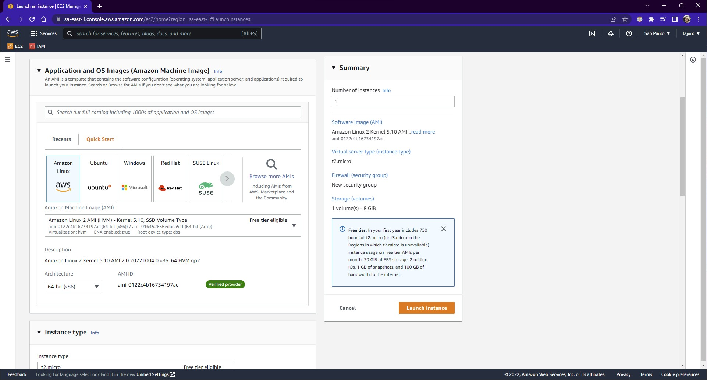

### **Criando uma instância Linux**

Basicamente da mesma forma que foi feito no artigo [Criando uma Instância Windows 2019](/docs/seções/seção-05/aula-31). Porém com a diferença de em `Application and OS Images (Amazon Machine Image)` será selecionado uma AMI Linux `Free tier`.

### **Acessando a instância Linux criada**

Conforme descrito no artigo [Acessando a Instância Windows 2019](/docs/seções/seção-05/aula-32/), já é explicado como acessar ambos os ambientes, Linux e Windows.
