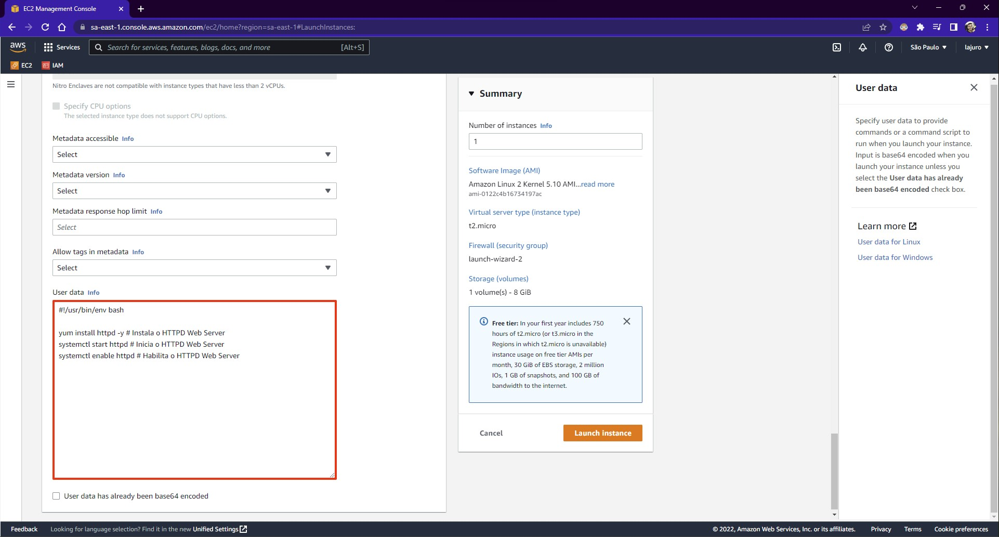

### **O que é User Data?**

É o nome dado ao script que você pode definir para ser executado somente uma vez, na criação da instância, como por exemplo:

```bash
yum install httpd -y # Instala o HTTPD Web Server
systemctl start httpd # Inicia o HTTPD Web Server
systemctl enable httpd # Habilita o HTTPD Web Server
```



O campo `User data` fica disponível na seção `Advanced details`, no momento de criação da instância.
