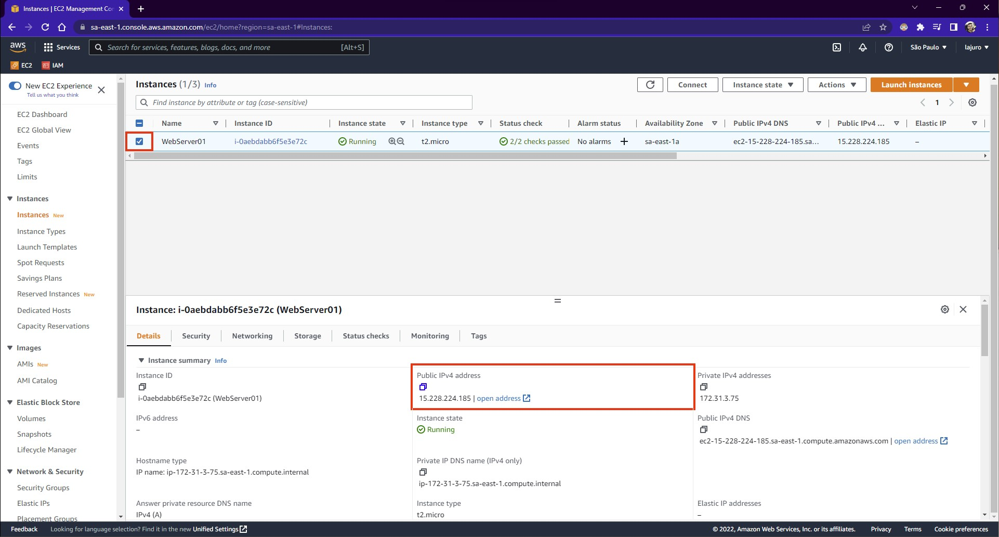
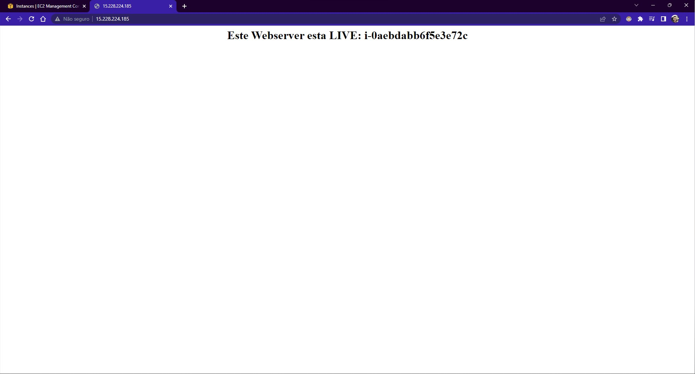

Para criação de uma instância com o script de inicialização (User data), seguirá basicamente como já foi passado na aula [Criando e acessando uma instância Linux](/docs/seções/seção-05/aula-31).

Na seção `Network settings`, crie um `Security Group` que permita o SSH e o tráfego HTTP, para que seja possível acessar via HTTP.

Na seção `Advanced details`, no campo `User data` preencha o seguinte script:

```bash
#!/bin/bash
yum update -y # Atualiza o Linux
yum install -y httpd # Instala o Webserver
systemctl start httpd # Inicia o Webserver
systemctl enable httpd # Habilita o Webserver

# Associa a identificação da instância em criação (Esta URL permanece sempre a mesma)
EC2ID=$(curl -s http://169.254.169.254/latest/meta-data/instance-id)

# Cria o HTML que será exibido no Webserver e salva em um arquivo index.txt
echo '<center><h1>Este Webserver esta LIVE: EC2ID </h1></center>' > /var/www/html/index.txt

# Substitui o valor EC2ID pelo valor da variável de ambiente criada $EC2ID e cria um arquivo index.html com o conteúdo
sed "s/EC2ID/$EC2ID/" /var/www/html/index.txt > /var/www/html/index.html
```

E então, clique em `Launch instance` para criar sua instância.

### **Acessando o Webserver criado nesta instância**

Após a criação da instância, selecione a instância e então em `Public IPv4 address` clique no botão de copiar (destacado em azul):



Após copiar o IP, acesse a URL que no caso deste exemplo é `http://15.228.224.185` e você deverá ver algo como o seguinte:



Desta forma, foi criado de maneira rápida um servidor web apenas ao criar a instância.
