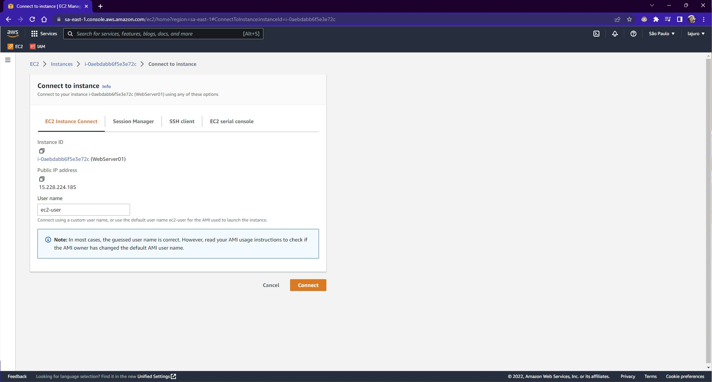

### **Como acessar o Bucket S3 via EC2**

Primeiro acesse sua instância, para isso acesse o serviço EC2, clique na opção `Instances` no menu lateral esquerdo e então selecione a instância que deseja acessar.

Clique em `Connect`, e na aba `EC2 Instance Connect` você poderá conectar na instância pelo próprio navegador:



Na tela que abrir, digite o seguinte comando:

```bash
sudo su
```

    Isso fará com que os próximos comandos sejam executados como administrador.

E então tentaremos ver todos os arquivos e diretórios do Bucket S3, para isso rode o seguinte comando:

```bash
aws s3 ls
```

Na primeira vez que executar esse comando, você deverá se deparar com o erro `Unable to locate credentials. You can configure credentials by running "aws configure"`, esse erro ocorre porque o acesso ao Bucket precisa que tenha configurado um `Access key ID` e um `Secret access key`, esses dados você deve ter salvo de quando criou um usuário IAM.

<div class="alert alert-info">
  <h4>Informação</h4>
  <p>Caso não tenha salvo esses dados do usuário que criou no IAM, acesse o serviço IAM e no menu lateral esquerdo clique em <code>Users</code>, acesse o usuário que deseja pegar esses dados e clique na aba <code>Security credentials</code>. Na seção <code>Access keys</code> você consegue criar um novo <code>Access Key</code> clicando em <code>Create access key</code> e então <u><b>não se esqueça de salvar o arquivo csv com esses dados</b></u>.</p>
</div>

Na sua instância, rode o seguinte comando para configurar um IAM Role:

```bash
aws configure
```

Será solicitado os seguintes dados:

- **AWS Access Key ID:** Esse dado é o que você deve ter salvo do seu `usuário IAM`
- **AWS Secret Access Key** Esse dado é o que você deve ter salvo do seu `usuário IAM`
- **Default region name** O nome da região padrão que está os serviços que deseja acessar via AWS CLI, no meu exemplo, preenchi como `sa-east-1`.
- **Default output format** O formato de saída que deseja pre definir, você pode consultar as opções [clicando aqui](https://docs.aws.amazon.com/pt_br/cli/latest/userguide/cli-usage-output-format.html).

Agora, estando os dados corretos, executando o comando `aws s3 ls` você deverá conseguir rodar com sucesso.

Caso não tenha nenhum bucket criado não deverá conseguir ver nada, mas caso queira testar, crie rapidamente um `bucket` ao acessar o serviço `S3`, preenchendo com as informações `default` e dando algum nome para esse bucket. Após criação desse bucket, você deverá conseguir ver algo desse tipo:


E para conseguir retornar o que tem dentro do bucket que foi criado, no meu caso o nome do bucket é `bucket-ec2-example`, rode o comando da seguinte forma:

```bash
aws s3 ls s3://bucket-ec2-example
```

Não deverá ver nada, caso não tenha feito o upload de algum arquivo no bucket criado, no meu caso fiz o upload de um arquivo .txt e exibiu da seguinte forma:


<div class="alert alert-danger">
  <h4>Importante</h4>
  <p>Esse método acaba sendo vulnerável, pois se algum usuário malicioso obter acesso a essa máquina, ele conseguirá ter acesso as credenciais usadas no <b>AWS CLI</b>, bastando executar o comando <code>cat ~/.aws/credentials</code>.</p>
</div>
