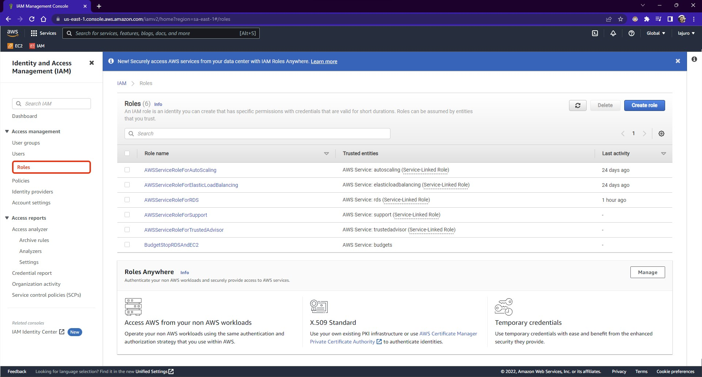
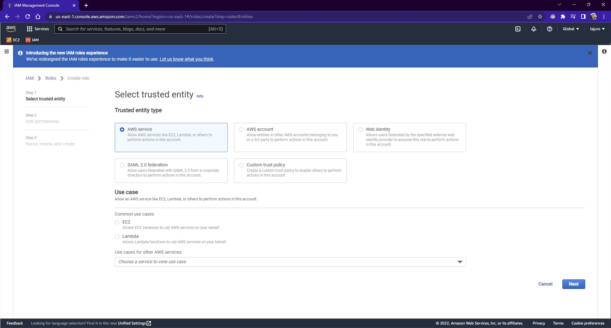
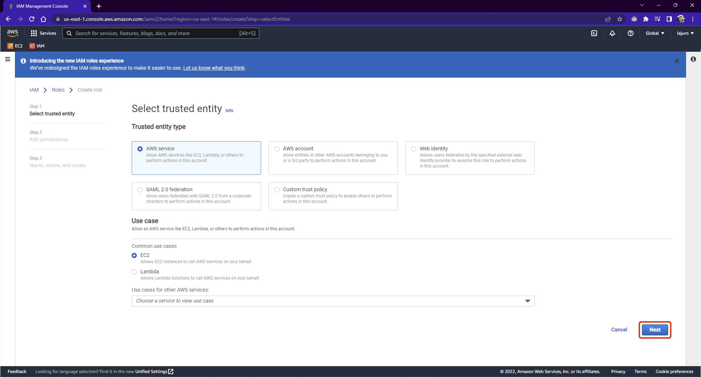
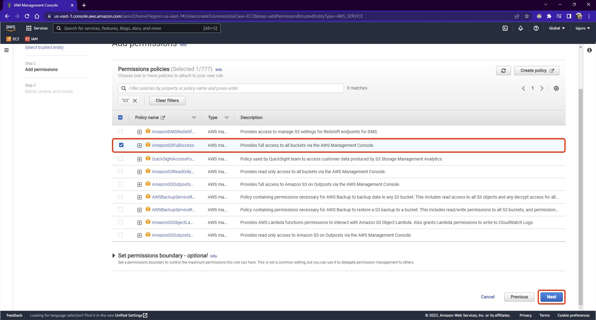
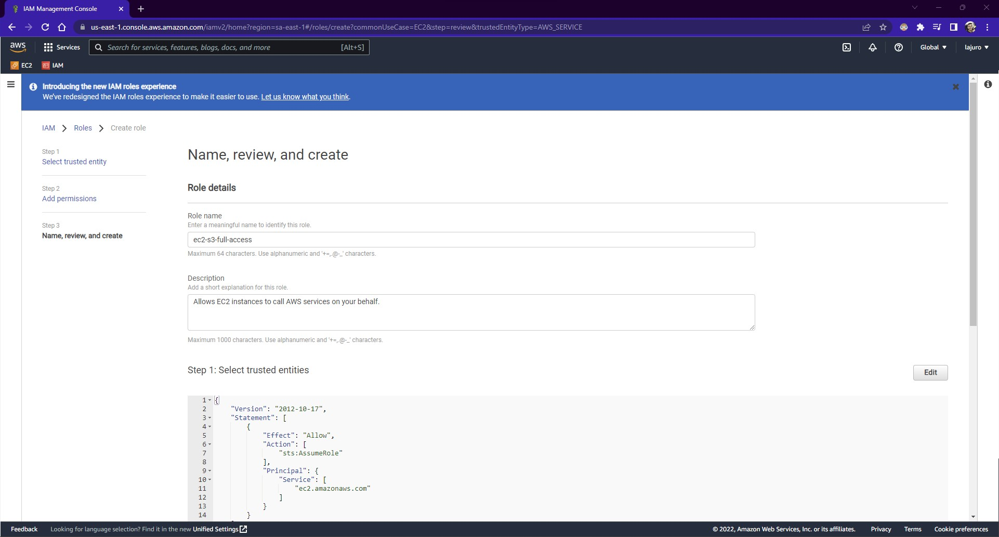
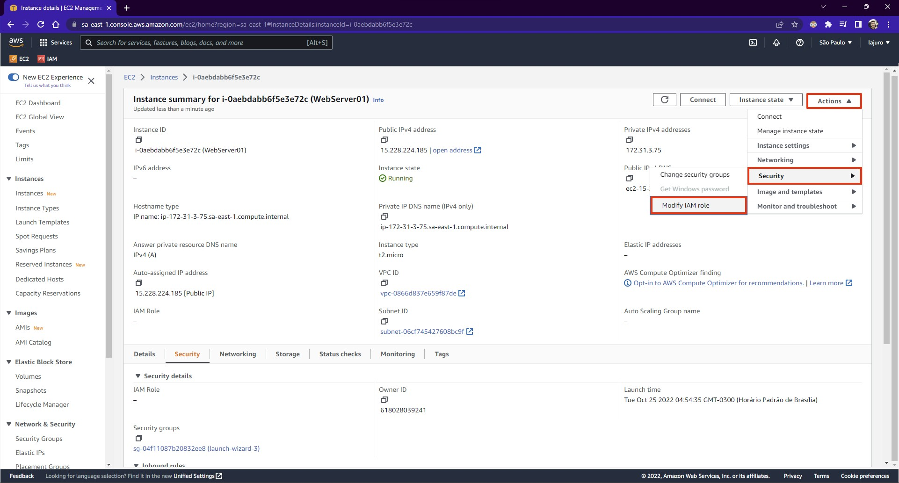
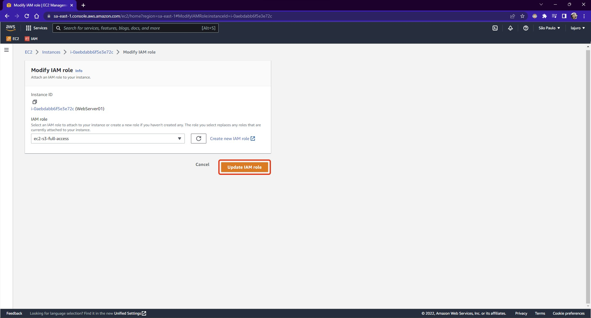
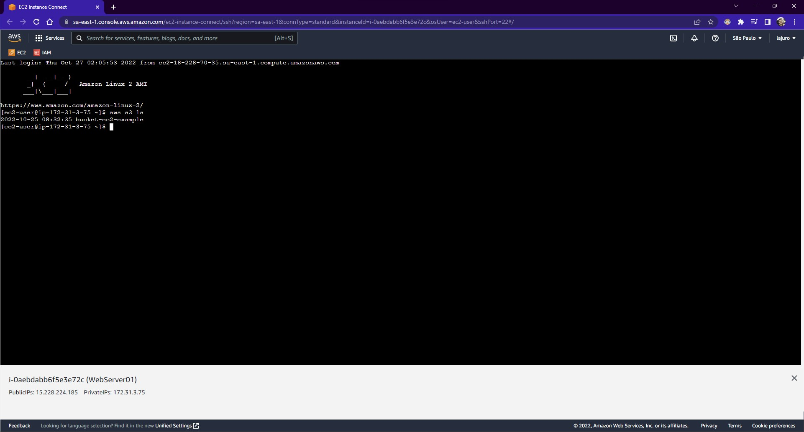

### **Por que usar essa forma e não via IAM User?**

O motivo, é que caso algum usuário malicioso tenha acesso a instância da AWS, ele conseguirá acesso as credenciais apenas digitando o comando `cat ~/.aws/credentials`.

### **Removendo a configuração de credenciais da instância**

Primeiramente acesse a rota onde fica o arquivo `credentials` e `config`, digite o seguinte:

```bash
cd ~/.aws
```

Para remover tudo da pasta, que é basicamente o que deve ser excluído mesmo que são os arquivos `credentials` e `config`. Digite o seguinte comando: <i style="display: inline-block; padding: .2rem .8rem; color: #FFFFFF; background-color: #e92d0f; font-size: .8rem; font-weight: bold; border-radius: .3rem;">Tenha certeza que está na pasta `.aws`</i>

```bash
rm -rf *
```

Feito isso, já estará com as credenciais excluídas!

### **Criando um IAM Role**

Acesse o serviço IAM, e no menu lateral esquerdo selecione a opção `Roles`:



Clique em `Create role`, conforme exibido na imagem anterior, o botão azul. Fazendo isso deverá abrir as configurações da `role` que está criando:



Como estamos criando essa role para um `Serviço AWS` e para uma máquina `EC2`, então selecione as opções correspondentes e então clique em `Next`, conforme a imagem abaixo:



Agora chegou a hora de configurar qual a permissão que deseja definir, para este exemplo, queremos que a instância EC2 tenha acesso aos buckets S3, então foi selecionado a permissão `AmazonS3FullAccess` e clique em `Next`, conforme a imagem abaixo:



Agora você apenas deve dar um nome para sua `Role` e verificar se está tudo ok, estando tudo ok, clique em `Create role`.



### **Atribuindo IAM Role criado a instância**

Volte até a instância EC2 que deseja atribuir esta permissão, e acesse-a. Então clique em `Actions`, `Security` e então em `Modify IAM role`:



Selecione a role que criou, no meu exemplo foi criada a role com o nome `ec2_s3_full_access` e então clique em `Update IAM role`:



Sendo assim, agora que a `role` está atribuída, quando conectar na máquina já deverá conseguir ter acesso completo ao serviço S3 sem configuração de acesso de um `IAM User`:


