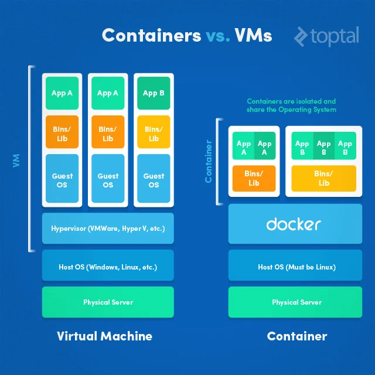

O Docker é uma ferramenta que veio para "mudar o jogo", principalmente para quem desenvolve aplicações desktop, web, softwares, aplicativos mobile, o Docker veio para mudar a indústria, como a virtualização veio para mudar a indústria de servidores, abaixo um exemplo do que é o Docker.

### **Comparação da Virtualização e o Docker**

Nada melhor do que uma imagem para mostrar uma comparação da estrutura de uma máquina virtual e um container.

Basicamente, isso resolve problemas onde antes sem o Docker, podia ocorrer problemas onde a diferença de computadores, fazia com que a aplicação rodasse em uma máquina mas não em outra, por qualquer motivo, como a versão do sistema operacional, alguma dependência, seja o que for. Já com o Docker, esse problema não existe justamente porque você tem um container, com uma imagem de um sistema operacional, com todas as configurações necessárias para essa aplicação rodar, pois não depende mais do sistema operacional da máquina do usuário, rodando exatamente igual para qualquer máquina.
