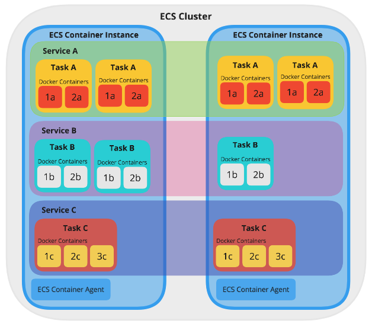

### **O que é o Elastic Container Service?**

O Amazon ECS é um serviço de orquestração de contêineres totalmente gerenciado que facilita a implantação, o gerenciamento e a escala de aplicações em contêineres.

### **Nomenclaturas dentro da ECS**

Existe uma diferença na nomenclatura utilizada dentro da ECS, segue abaixo:

- **Container:** Task
- **Image:** Registry (Elastic Container Registry - ECR)
- **Configurações:** Task Definition

### **Existem dois tipos de ECS**

#### **ECS EC2 Cluster**

Você é responsável por gerenciar o servidor.

#### **ECS Fargate**

Caso deseja uma solução *serverless*, ou seja, uma solução que não é necessário gerenciar uma EC2, você pode utilizar essa solução do ECS Fargate.
