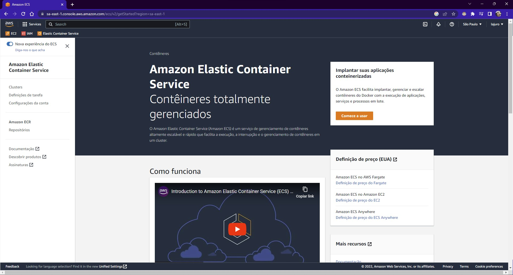
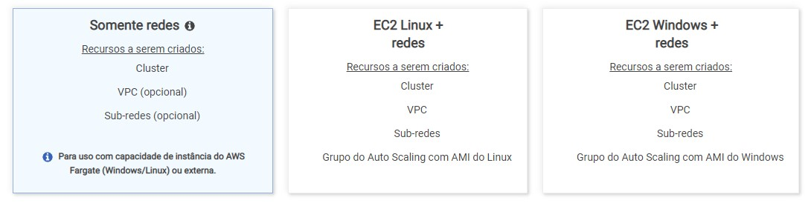
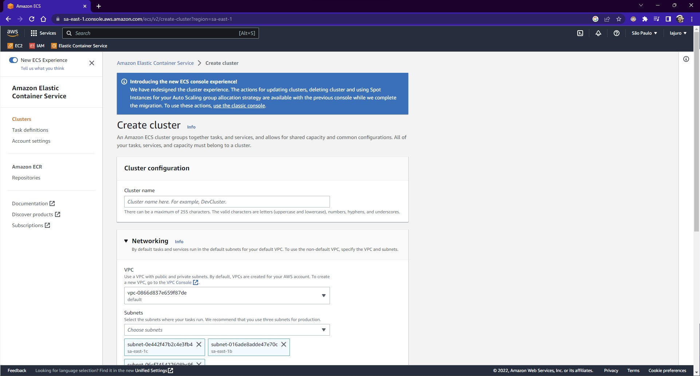
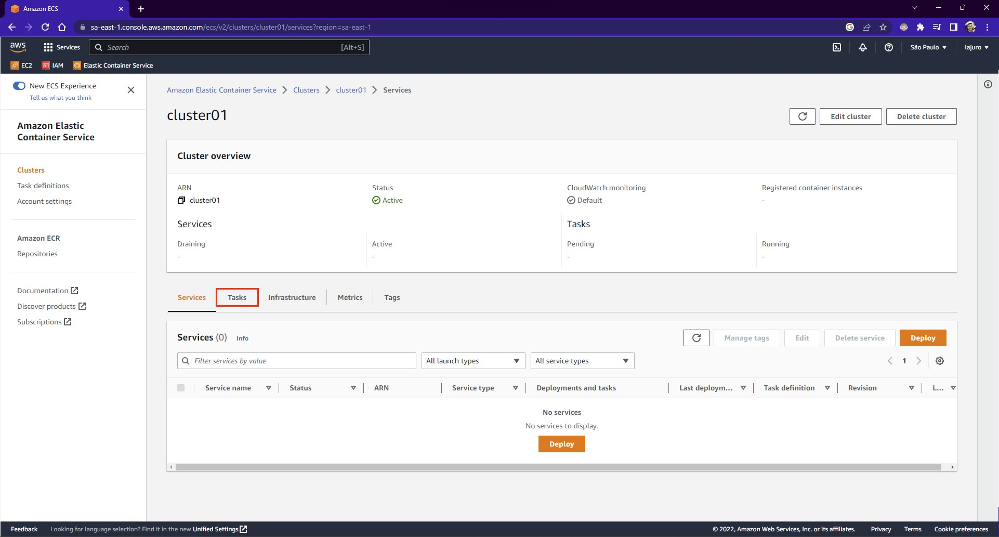
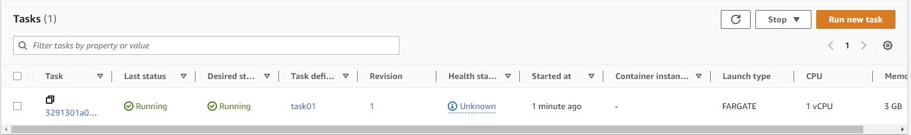
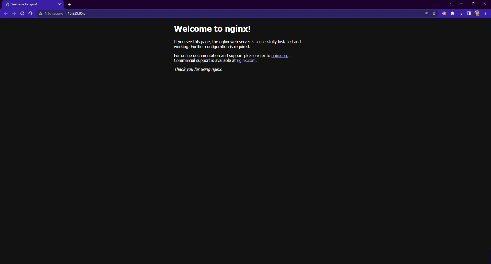

### **Acessando o Serviço ECS**

Na barra de pesquisa superior da pagina, pesquise por ECS e acesse o serviço `Elastic Container Service`.

### **Criando o Cluster**

Acesse `Cluster` e então clique em `Create cluster`, você verá que existem 3 tipos de cluster que podem ser criadas:

  <h4>Importante</h4>
  
Com o novo design da AWS, já é utilizado por padrão o primeiro modelo destacado na imagem acima, não é solicitado nenhuma informação de qual modelo deseja seguir.

  

#### **Preenchendo os dados do cluster**

Para esse exemplo, será criado um cluster com o nome `cluster01`, caso esteja no modelo clássico, pode ser criado sem atribuir a uma VPC, já no modelo novo já é pré-selecionado uma VPC não tendo a opção de criar sem uma VPC.

Neste exemplo só foi criado um nome e então clicamos em `Create` para que o cluster seja criado.

### **Criando uma Task Definition**

Acesse, no menu lateral esquerdo do serviço ECS, a opção `Task definitions` e então clique em `Create new task definition`.

Estando na interface nova, preencha o nome da `Task Definition`, para este exemplo criei como `task01` e então nos campos `Name` e `Image URI` do container, preenchi com `nginx` e basicamente é isso, então pode clicar em `Next`.

No passo `Configure environment, storage, monitoring, and tags` não será necessário configurar nada, apenas certifique-se que no campo `App environment` esteja preenchido com `AWS Fargate (serverless)` e então clique em `Next`.

No passo `Review and create`, apenas revise se está tudo configurado conforme foi preenchido nos passos anteriores e então clique em `Create`, assim será criado esta Task Definition.

### **Configurando sua Cluster com a Task Definition Criada**

No menu lateral esquerdo, volte para a opção `Clusters` e então acesse a sua cluster, que no exemplo, está com o nome `cluster01`. No menu mais abaixo, acesse a opção `Tasks`:

E então clique em `Run new task` no canto superior direito.

Nas configurações, basicamente será apenas selecionar a `task` em `Deployment configuration` no campo `Family` e então clique em `Deploy` para que seja feito o provisionamento.

Você já deverá ser direcionado para a página principal da cluster criada onde atribuiu a Task Definition, e aguarde até o status ficar como `Running`, conforme a seguinte imagem:

Após isso, clique na `Task` clicando no link da coluna `Task` e em `Configuration` você deverá ver o `Public IP`, copie esse IP e tente acessar em seu navegador, deverá ter um resultado como o seguinte:

